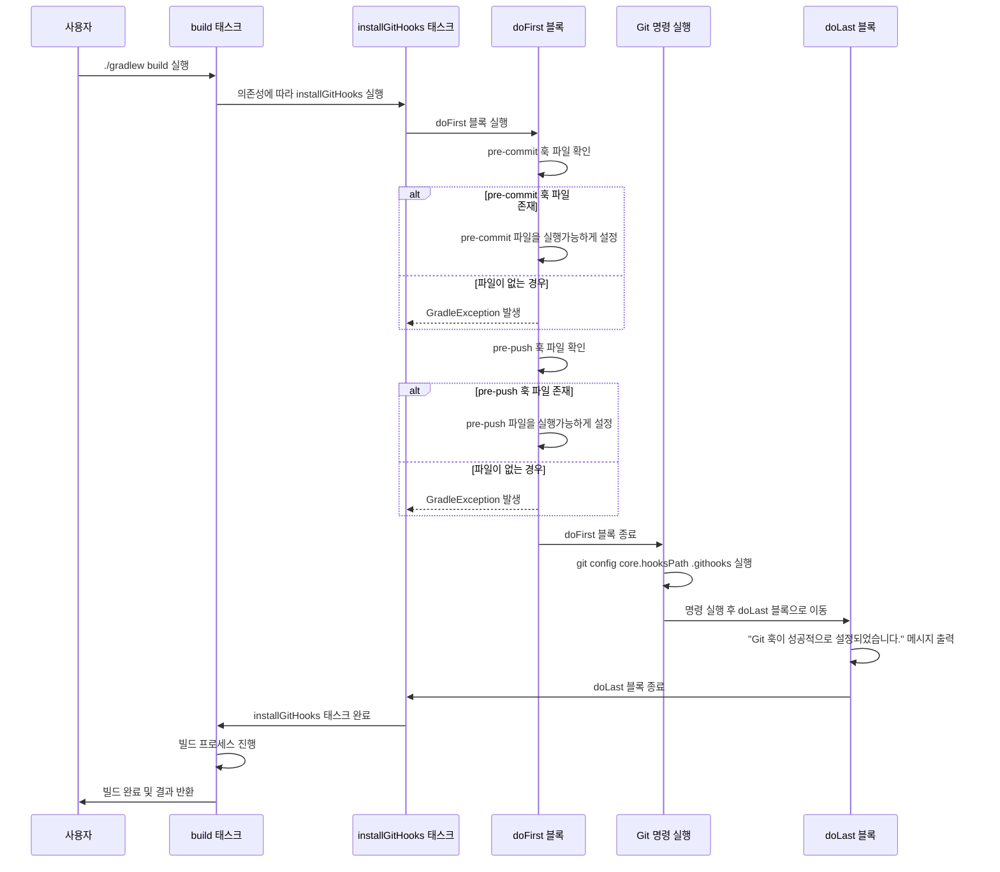

## 발단
현재 우리 백엔드 프로젝트는 자바 계열에서 주로 쓰는 정적 분석 도구, ``Checkstyle`` 을 이용하여 컨벤션을 준수 하고 있었다. 그런데 언제부턴가 인덴트, 공백, 줄 바꿈과 같은 컨벤션이 제대로 지켜지지 않는 코드들이 중간 중간 발생하였고 그로 인해 종종 CI 가 실패하는 현상이 생겼다.

## 문제 원인
우리는 ``pre-commit`` 이라는 깃훅을 이용하여 커밋 하기 전에 build.gradle 에 정의한 checkstyle 태스크를 실행하도록 설정해놓았다. 그래서 공용으로 사용할 ``pre-commit`` 파일을 작성 한 다음, Git Wiki 에 가이드라인과 함께 공유해놓았다. 팀원들은 가이드에 맞춰 각자 로컬 환경에서 ``pre-commit`` 작성해주면 끝이였다.

![[Pasted image 20250519001257.png]]

문제는 로컬 개발 환경이 달라질 경우, 즉, 새롭게 git clone 을 받은 경우 ``.git`` 폴더가 새로 생성 되기 때문에  매번 ``pre-commit`` 파일을 다시 수정해줘야했다. 그렇기 때문에 **혹시나 깜빡하고 ``pre-commit`` 을 정의하지 않은 경우** 체크스타일 검수가 이뤄지지 않은 채로 코드가 커밋되고 푸쉬된것이였다. 

> 🤔 매번 프로젝트를 clone 받을 때마다 일일이 pre-commit 을 설정하지 않고 자동으로 공유되고 적용 시킬 순 없을까?
## 해결책

앞서 살펴본 문제 원인을 통해 우리가 보완 및 개선해야 할 점은
1. 깃 훅은 자동으로 공유 되어야한다.
2. 프로젝트 생성 (git clone) 시 마다 깃 훅 설정을 다시할 필요가 없어야한다.

이 두가지를 해결 하기 위해 다음 두 작업을 실시했다.
### 1. core.hooksPath 를 변경하여 깃 훅을 공유하고 중앙에서 관리하자

기존 문제점은 깃 훅들이 공유 되지 않는다는 것이였다. 현재 우리 프로젝트는 깃 훅들을 ``.git/hooks`` 안에 관리하고 있었다. 문제는 ``.git`` 폴더는 공유할 수 없는 폴더인것이다. 깃 훅과 같은 파일들은 팀이나 프로젝트에서 공통으로 사용되어야할 파일인데 공유를 할 수 없다는건 문제가 생길 수 밖에 없었다. 그래서 그런지 깃은 2.9 버전 부터 ``core.hooksPath`` 설정을 통해 ``hooks`` 디렉토리의 위치를 임의로 지정 할 수 있게 되었다.

즉, 깃훅들의 보관소를 ``.git`` 외의 다른 폴더로 지정 할 수 있게 된 것이다 (=공유 가능)

![[Pasted image 20250519004729.png]]

이렇게 루트에 ``.githooks`` 라는 폴더를 만든 다음, 깃 훅들을 그 안에 정의 해놓고

```shell
git config core.hooksPath .githooks
chmod +x .githooks/깃훅파일명
```
라고 명령어만 입력해줌으로써 버전관리와 파일 공유를 손쉽게 할 수 있게 되었다. 
### 2. build.gradle 에 깃 훅 설정 스크립트 작성

> 🤔 근데 말이지,,, 저 명령어 입력 하는 것 조차 때론 깜빡할 수 있지 않을까? 

충분히 가능성 있다.  그래서 이를 해결하기위해 gradle 스크립트 파일을 다음과 같이 작성해주었다.

```groovy
// GitHooks 셋업 태스크  
tasks.register('installGitHooks', Exec) {  
  description = 'Git 훅을 설정합니다'  
  group = 'setup'  
  
  doFirst {  
    // pre-commit 훅 설정  
    def preCommitFile = file("${rootDir}/.githooks/pre-commit")  
    if (preCommitFile.exists()) {  
      preCommitFile.setExecutable(true)  
    } else {  
      throw new GradleException("pre-commit 훅 파일이 존재하지 않습니다. .githooks/pre-commit 파일을 생성하세요.")  
    }  
  
    // pre-push 훅 설정  
    def prePushFile = file("${rootDir}/.githooks/pre-push")  
    if (prePushFile.exists()) {  
      prePushFile.setExecutable(true)  
    } else {  
      throw new GradleException("pre-push 훅 파일이 존재하지 않습니다. .githooks/pre-push 파일을 생성하세요.")  
    }  
  
  }  
  
  // git config 명령 실행  
  commandLine 'git', 'config', 'core.hooksPath', '.githooks'  
  
  doLast {  
    println "Git 훅이 성공적으로 설정되었습니다."  
  }  
}  
  
// 모든 프로젝트에 대한 설정을 적용하기 위해 build 태스크에 의존성 추가  
tasks.named('build') {  
  dependsOn 'installGitHooks'  
}
```

#### ``installGitHooks`` 
  -  깃 훅을 셋업 해주는 gradle task
  - ``.githooks`` 에 깃 훅 파일이 있는지 없는지 확인 후에, 있으면 실행 권한을 부여. 없으면 예외 처리
  - ``git config core.hooksPath .githooks`` 명령어를 실행하여 깃 훅 디렉토리 경로 설정

``installGitHooks`` 태스크를 등록해준 다음 ``build`` 태스크에 의존성을 추가해주면 앞으로 프로젝트를 빌드해줄 때마다 알아서 깃 훅 설정이 될것이다.


